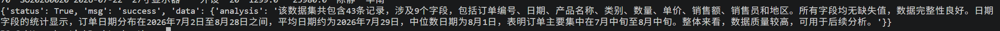
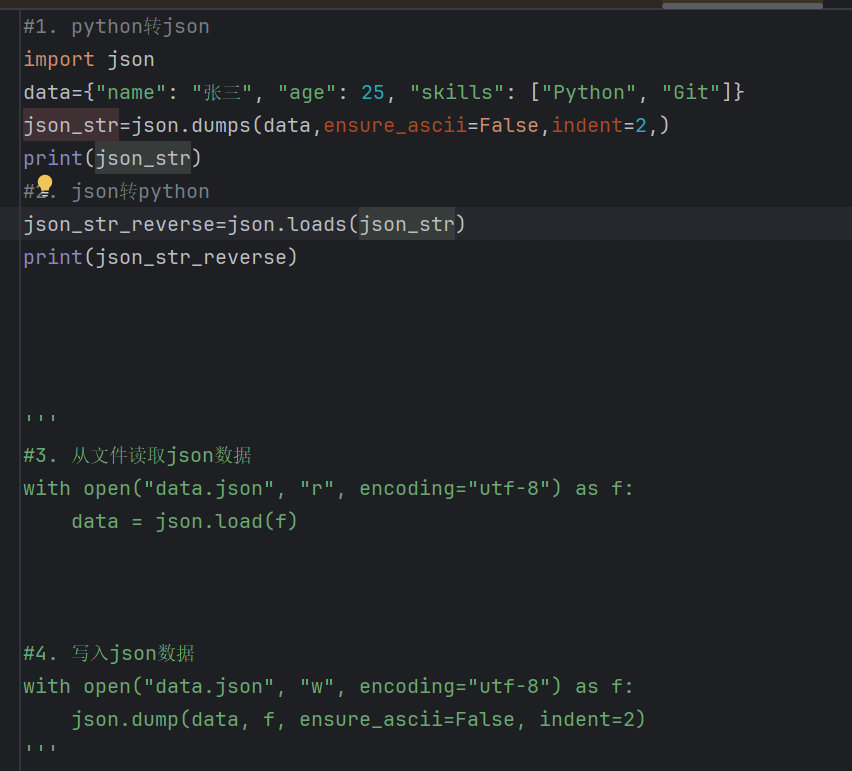

# 第一次自己调大模型 API
#### 注册 DeepSeek 开放平台，充 10 块钱
> 重要：API Key 必须放在 .env 文件里，.env 必须写进 .gitignore。绝对不能提交到 GitHub。
#### 搞懂几个概念：messages、role、token 怎么计费
##### 结构一：LLM对话标准（message为主体）
- 主体：message（单条消息）
- 包含：role（发送者身份）、payload（消息正文数据）
- 关系：message 外层，role、payload 是 message 的两个字段

##### 结构二：通讯协议/WebSocket（payload为外层数据包）
- 主体：payload（传输载荷包）
- 包含：role（发送者身份）、message（消息内容对象）
- 关系：payload 外层，role、message 内嵌在 payload 内部

> 重点：命名没有全局强制规范，以项目JSON结构为准。

##### 2、两大计费项（主流LLM API标准）
1. **输入token（prompt_tokens）**
包含：system系统提示词、全部历史对话消息、用户当前提问、附加文档内容。
> 多轮对话关键点：每次请求完整携带历史message，历史内容重复计入输入token；无缓存时每次重复收费。

2. **输出token（completion_tokens）**
模型实时生成的回复文本；**绝大多数模型输出单价高于输入**。

计算公式：
> 单次费用 = 输入token数量 × 输入单价 + 输出token数量 × 输出单价

#### 把你算出来的统计结果交给 AI，让它写一段文字分析

#### 1. 让 AI 返回规整的 JSON（要用 API 的 response_format 参数，不是在提示词里说一句"请返回JSON"就行）
#### 2. 加上错误处理：断网了、API 报错了，程序要给提示，不能直接崩
[call_script](./python/llm_api.py)

## json相关知识复习
| 方法 | 作用 | 方向 |
| ---- | ---- | ---- |
| `json.dumps()` | Python对象 → JSON字符串 | 内存中转换 |
| `json.loads()` | JSON字符串 → Python对象 | 内存中转换 |
| `json.dump()`  | Python对象 → 写入JSON文件 | 操作磁盘文件 |
| `json.load()`   | 读取JSON文件 → Python对象 | 操作磁盘文件 |
